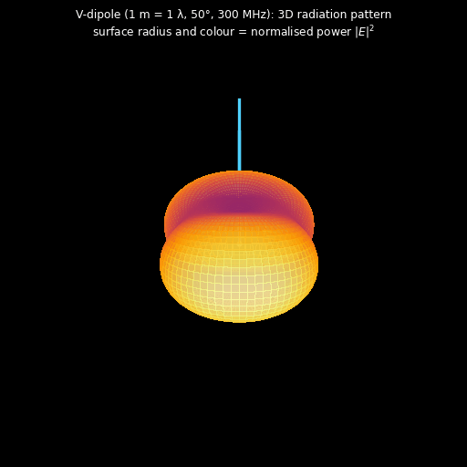
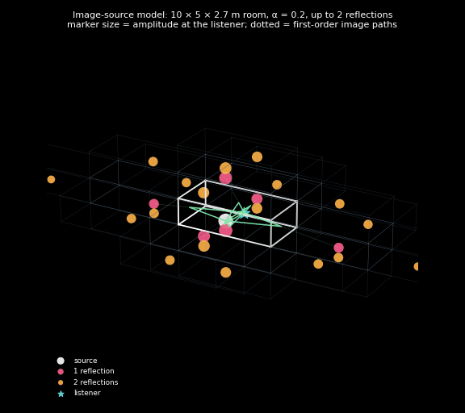

# Physics Simulations

[](https://github.com/MrHbogart/simulations/actions/workflows/tests.yml)

Three simulation projects across acoustics, solid-state physics and electromagnetics. Each one is a small, readable Python package with a research notebook on top, and each is **checked against known physics** by automated tests rather than only producing nice pictures.

| | Project | Physics | Numerical method |
|:--:|:--|:--|:--|
|  | **[Room acoustics](room-acoustics/)**<br>Reverberation, clarity and absorber placement in a room | Wave propagation, reflection, room-acoustic metrics (ISO 3382) | Image-source method with 4.5 M vectorized images, Schroeder integration, octave-band filtering |
|  | **[Semiconductor physics](semiconductor-physics/)**<br>Silicon from band structure to p-n junctions and solar cells | Quantum mechanics in crystals, carrier statistics, device physics | Plane-wave empirical pseudopotential eigenproblem, 2,000-site tight-binding diagonalization, detailed balance |
|  | **[Antenna electromagnetics](antenna-em/)**<br>Near and far fields of wire antennas and a radio link | Maxwell's equations, radiation, power flow | Hertzian-dipole Green's-function superposition on a 151³ grid, phasor-to-time-domain animation |

## 3D renders

Each project has a `render_3d.py` that rebuilds these straight from its package (about a minute each, no notebook needed).

| | |
|:--:|:--:|
| <br>**Silicon bands over the $k_z=0$ plane.** The top valence bands and the lowest conduction band from the EPM solver, with the four in-plane conduction minima at 0.85 Γ–X. | <br>**Six conduction valleys of silicon.** Every k-point within 150 meV of the conduction-band minimum, inside the first Brillouin zone: the six Δ ellipsoids along ⟨100⟩. |
| <br>**Antenna radiation pattern.** Far-field power of the 1 m V-dipole at 300 MHz (a full-wave antenna), from the same segment superposition as the field animations. | <br>**Image-source model.** Mirrored rooms up to second order. Each image source is sized by its amplitude at the listener, and the green lines are the six first-order reflection paths. |

## Validated against theory

Every project ships a `tests/test_physics.py` that runs in CI:

| Project | Check | Result |
|:--|:--|:--|
| Room acoustics | Late reverberant decay vs. exact specular-room theory (not diffuse-field Eyring, which doesn't apply to a shoebox) | T30 = 0.57 s vs 0.56 s |
| Room acoustics | Image geometry: all six first-order mirrors, image count = octahedral number | exact |
| Semiconductor | Si band structure vs. Cohen–Bergstresser: Γ₂₅′→Γ₁₅, valence width, CBM at 0.85 Γ–X, X₁ degeneracy | within 0.2 eV |
| Semiconductor | Shockley–Queisser: blackbody sun irradiance and Si efficiency limit | 1317 W/m², 30.1% |
| Antenna EM | Faraday's law $\mathbf{H} = \nabla\times\mathbf{E}/(-j\omega\mu_0)$ in near, intermediate and far zones | 10⁻⁴ relative |
| Antenna EM | Radiated power vs. $\eta_0 (k\ell)^2 I^2/12\pi$ | 0.1% |

## Quick start

```bash
git clone git@github.com:MrHbogart/simulations.git && cd simulations
python -m venv .venv && source .venv/bin/activate
pip install -r requirements.txt

cd room-acoustics && python -m pytest -q tests && jupyter notebook room_simulation.ipynb
```

Each project runs on its own from its own folder. Notebooks write their figures and animations to that project's `result/` or `results*/` folder, and the committed outputs come from the current code.

## Repository layout

```
room-acoustics/          soundwaves package   + room_simulation.ipynb, render_3d.py
semiconductor-physics/   quantsim package     + silicon_epm_diode.ipynb, supercell_tightbinding_si.ipynb, render_3d.py
antenna-em/              emsim package        + single_antenna.ipynb, multi_antenna_link.ipynb, render_3d.py
requirements.txt         shared dependencies (NumPy 2, SciPy, Matplotlib, Plotly)
.github/workflows/       CI running each project's physics tests
```

Python 3.10+. The projects were originally developed as separate repositories (`soundwaves_sim`, `qt_sim`, `elegnetic_sim`) and are consolidated, reviewed and extended here.
