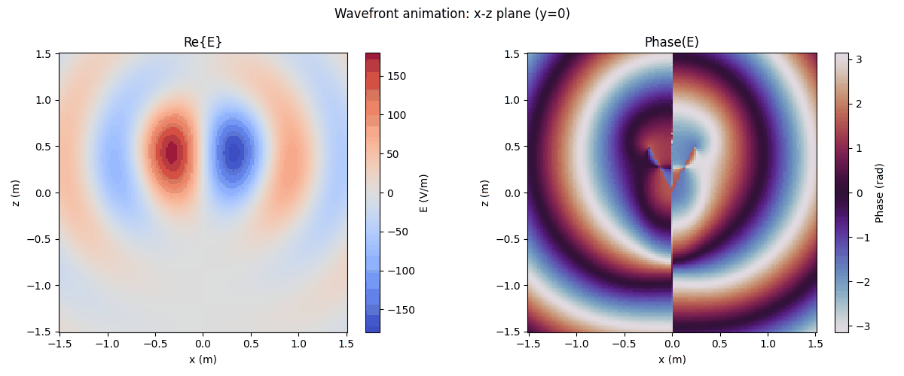
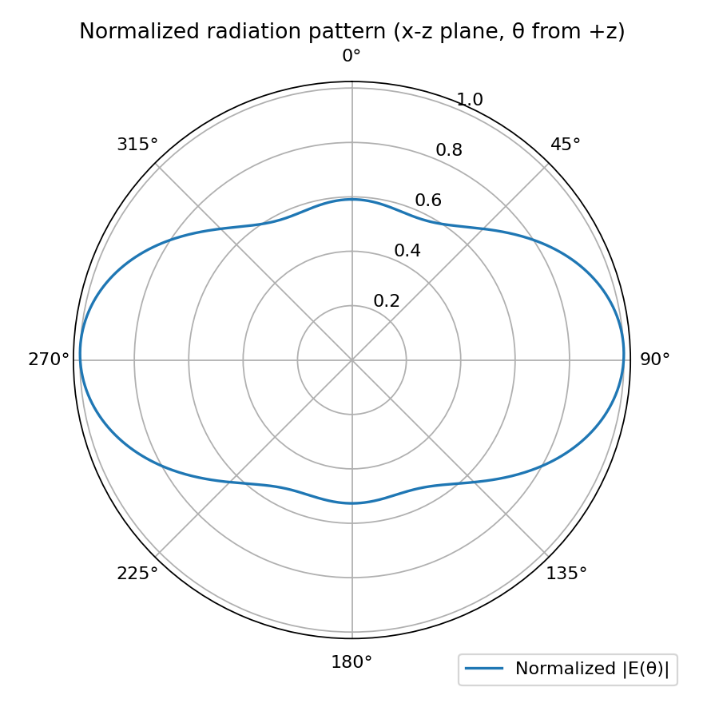
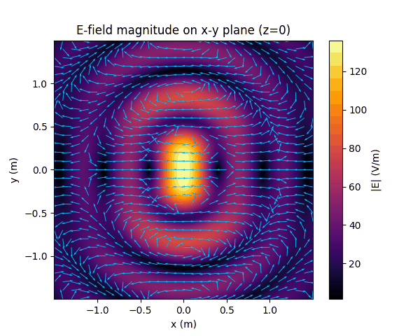
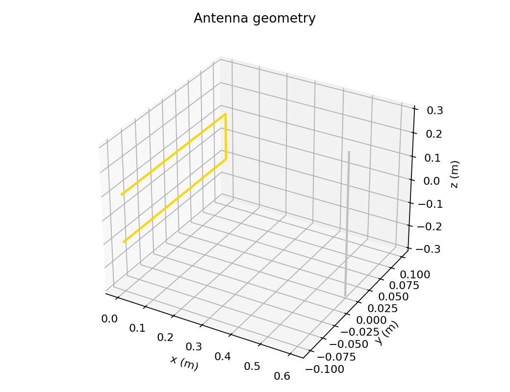
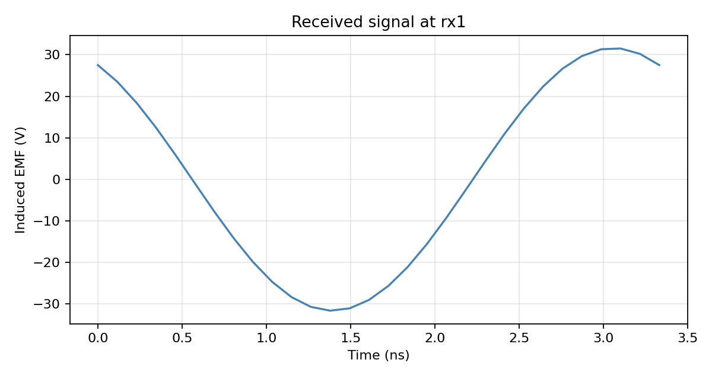

# Antenna Electromagnetics: Wire Antennas and Radio Links

NumPy-first frequency-domain field solver for thin-wire antennas. Any polyline (straight wire, V-dipole, loop, rectangle, or a custom path) becomes a chain of short Hertzian dipoles carrying a sinusoidal (or uniform) current. Their exact near-, intermediate- and far-zone fields are superposed on a 151³ grid and animated in the time domain.



## Model

Time-harmonic fields with $e^{j\omega t}$. A segment with current $I$, length $\ell$ and direction $\hat{\mathbf{d}}$ has dipole moment $\mathbf{p} = I\ell\hat{\mathbf{d}}/(j\omega)$ and radiates

$$
\mathbf{E} = \frac{e^{-jkr}}{4\pi\varepsilon_0}\left[k^2\frac{(\hat{\mathbf{n}}\times\mathbf{p})\times\hat{\mathbf{n}}}{r} + \big(3\hat{\mathbf{n}}(\hat{\mathbf{n}}\cdot\mathbf{p}) - \mathbf{p}\big)\left(\frac{1}{r^3} + \frac{jk}{r^2}\right)\right],
\qquad
\mathbf{H} = \frac{c}{4\pi}\,(\hat{\mathbf{n}}\times\mathbf{p})\left(\frac{k^2}{r} - \frac{jk}{r^2}\right)e^{-jkr}.
$$

Derived quantities: $|\mathbf{E}|$, $|\mathbf{H}|$, the time-averaged Poynting vector $\tfrac12\Re\{\mathbf{E}\times\mathbf{H}^*\}$, far-field patterns, and $\Re\{\mathbf{E}e^{j\omega t}\}$ snapshots for animation.

## Validation (`tests/test_physics.py`)

- **Faraday's law**: $\mathbf{H} = \nabla\times\mathbf{E}/(-j\omega\mu_0)$ (finite differences) holds to 10⁻⁴ at $kr$ = 0.3, 1.9 and 31.
- **Radiated power**: integrating the Poynting vector over a sphere gives $P = \eta_0 (k\ell)^2 |I|^2 / 12\pi$ to 0.1%.
- **Discretization**: a coarse custom path, resampled along its arc length, matches a finely sampled wire.

## Notebooks

**`single_antenna.ipynb`**: one antenna (here a 1 m V-dipole with a 50° opening at 300 MHz). Produces E/H field slices on three planes, Poynting flow, wavefront phase, 3D field views and the far-field pattern.

| Far-field pattern | E-field, x–y plane |
|:--:|:--:|
|  |  |

**`multi_antenna_link.ipynb`**: several antennas, each a transmitter, receiver or both (with optional time-scheduled role switching). The fields of all transmitters are superposed. Each receiver's induced EMF is the line integral $\int \mathbf{E}_\text{inc}\cdot d\mathbf{l}$ along its wire, evaluated exactly at every segment. The demo link (a U-shaped 0.6 m wire transmitter and a straight 0.6 m receiving wire 0.6 λ away) gives about 32 V for a 1 A feed.

| Link geometry | Received signal |
|:--:|:--:|
|  |  |

## Run it

```bash
pip install -r ../requirements.txt
jupyter notebook single_antenna.ipynb       # ~6 min on 4 cores (151^3 grid, 360 wire segments)
jupyter notebook multi_antenna_link.ipynb   # ~3 min
python -m pytest -q tests
```

Animations are written as GIFs to `results/<run-id>/` and not embedded in the notebooks, which keeps the notebooks small.

## Layout

- `emsim/antenna.py`: dipole and polyline wire antennas, path generators, arc-length resampling
- `emsim/fields.py`: Hertzian dipole fields and segment superposition, plus a toy conductor-interior model
- `emsim/grid.py`, `emsim/viz.py`: grids, spherical coordinates, field magnitude, Poynting vector

## Limitations

Currents are prescribed (sinusoidal or uniform), not solved self-consistently: there is no Method-of-Moments impedance matrix, so input impedance and mutual coupling are out of scope. The receiver is treated as an open-circuit probe that doesn't re-radiate. Free space only.
