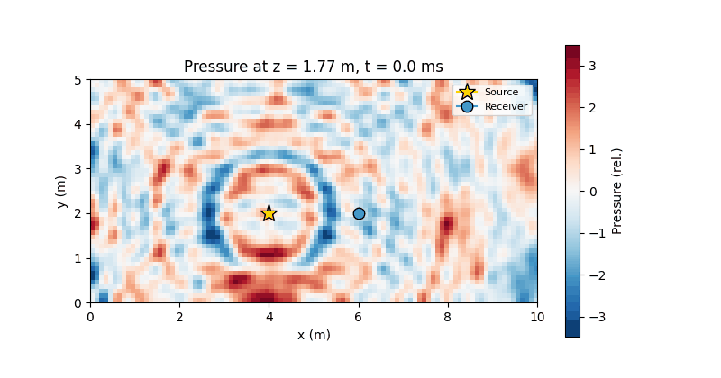
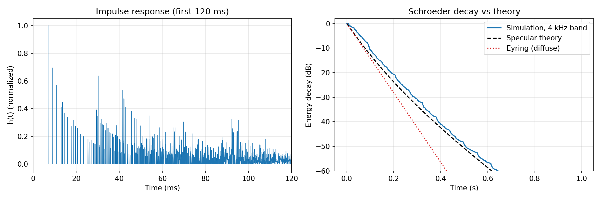
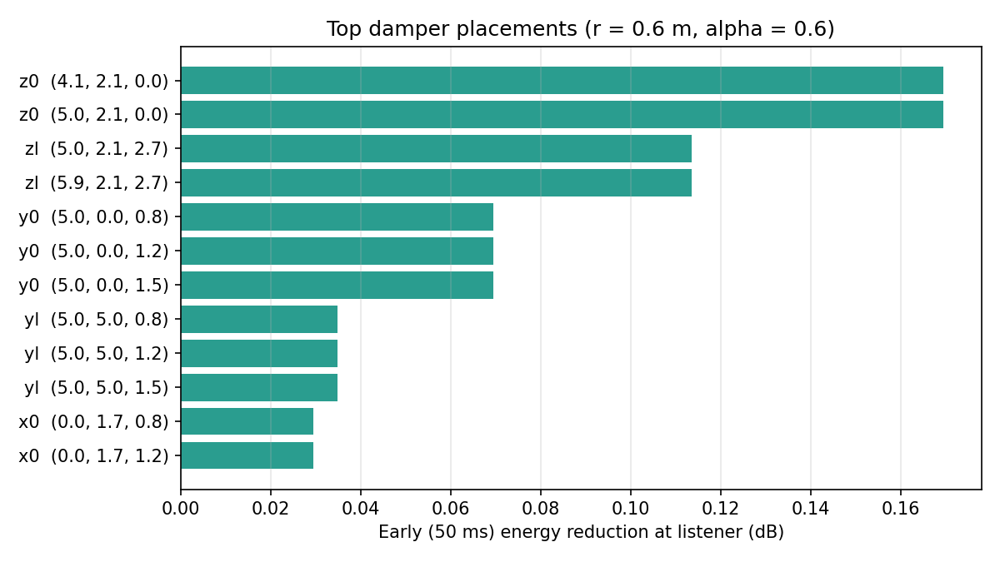

# Room Acoustics: Image-Source Simulation

Simulates how sound reverberates in a rectangular room using the **image-source method**, and uses the result to work out **where acoustic panels help most**. The notebook `room_simulation.ipynb` runs the full study: room setup → 3D pressure field → impulse response → reverberation and clarity metrics → damper placement sweep.



## Model

Each wall reflection is replaced by a mirrored "image" source. For a shoebox room of size $L_x \times L_y \times L_z$, the image with signed per-axis reflection indices $(k_x, k_y, k_z)$ has undergone $N = |k_x|+|k_y|+|k_z|$ reflections, and the pressure at a point is

$$
p(\mathbf{x}, t) = \sum_{\text{images}} \left(\sqrt{1-\alpha}\right)^{N} \frac{A\,e^{-\beta r}}{r}\; s\!\left(t - \frac{r}{c}\right)
$$

where $\alpha$ is the wall's energy absorption coefficient (so pressure scales by $\sqrt{1-\alpha}$ per bounce), $\beta$ is air attenuation, and $s$ is the source signal.

- **Impulse response**: one arrival per image, binned at 16 kHz with up to 150 reflections (≈4.5 M images, vectorized in NumPy, under a second).
- **Metrics** (ISO 3382 style): Schroeder energy decay, EDT/T20/T30, and C50/C80/D50 measured from the direct-sound arrival, per octave band (4th-order Butterworth filters).
- **Treatment study**: candidate absorber patches on every surface. Each one is scored by how much it reduces early (first 50 ms) energy at the listener by damping the first-order reflection it intercepts.

## Validation

Sabine and Eyring formulas assume a *diffuse* sound field. A specular shoebox room isn't diffuse: rays travelling along the long axis hit walls rarely, so the late decay is slower. For an incoherent (high-frequency) image sum, the exact energy decay is the direction average $\langle (1-\alpha)^{c t \sum_i |u_i|/L_i} \rangle$ times air loss. The simulation reproduces it:

| Estimate (10 × 5 × 2.7 m room, α = 0.2) | RT60 (s) |
|:--|--:|
| Sabine (diffuse, no air) | 0.60 |
| Eyring (diffuse, with air) | 0.42 |
| Specular theory, T30 | 0.56 |
| **Simulation, 4 kHz band, T30** | **0.57** |



`tests/test_physics.py` checks the image geometry (all six first-order mirrors, image counts) and the decay-vs-theory agreement to within 10%.

## Damper placement



The floor patch under the source–listener path ranks first, as expected: the floor bounce is the shortest first-order reflection. The full ranking is in `result/*/damper_effects_summary.csv`, and `damper_placement_animation.html` is an interactive 3D view.

## Run it

```bash
pip install -r ../requirements.txt
jupyter notebook room_simulation.ipynb   # ~3 min end to end
python -m pytest -q tests
```

The notebook also writes `pressure_field_animation.html`, an interactive 3D isosurface animation (~20 MB, not committed).

## Layout

- `soundwaves/geometry.py`: room box and vectorized image-source generation
- `soundwaves/simulation.py`: pressure field, impulse response, reflection arrivals
- `soundwaves/analysis.py`: decay curves, RT/clarity metrics, octave bands, damper model
- `soundwaves/visualization.py`: Plotly 3D animations and report figures
- `result/`: outputs of the committed run

## Limitations

Frequency-independent wall absorption, specular reflections only (no scattering or diffraction), and point sources and receivers. Low-frequency bands show the coherent, modal behaviour of an ideal shoebox, which real rooms with diffusing surfaces soften.
