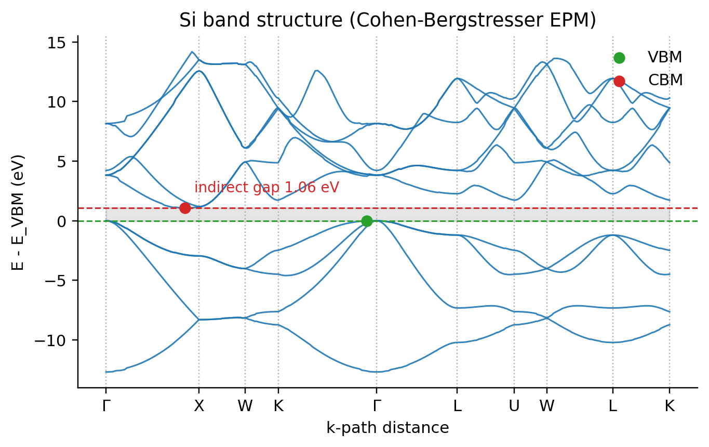
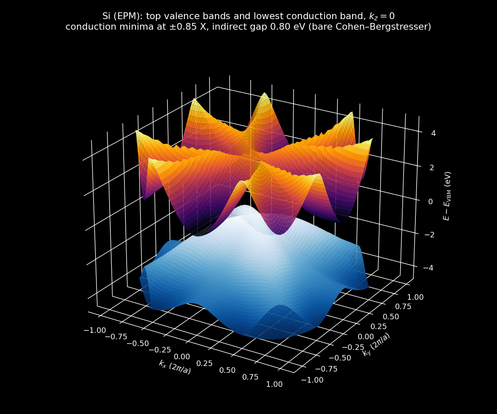
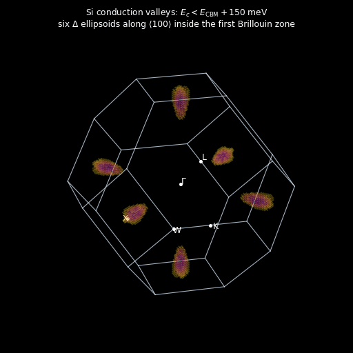
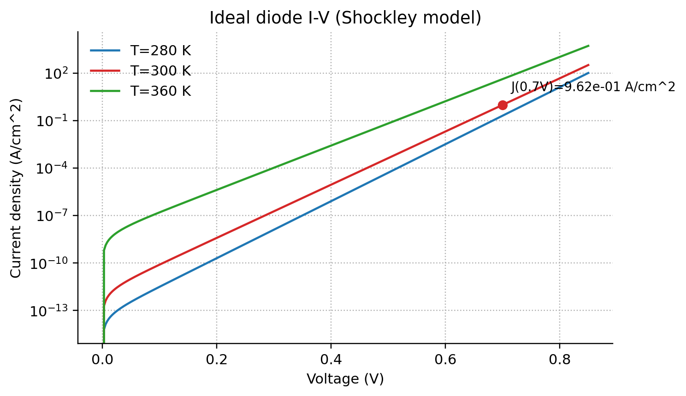
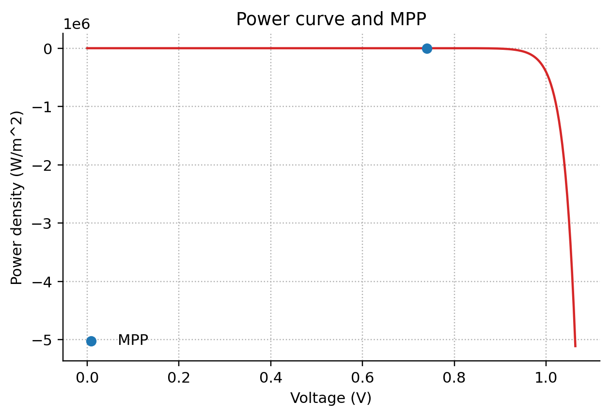
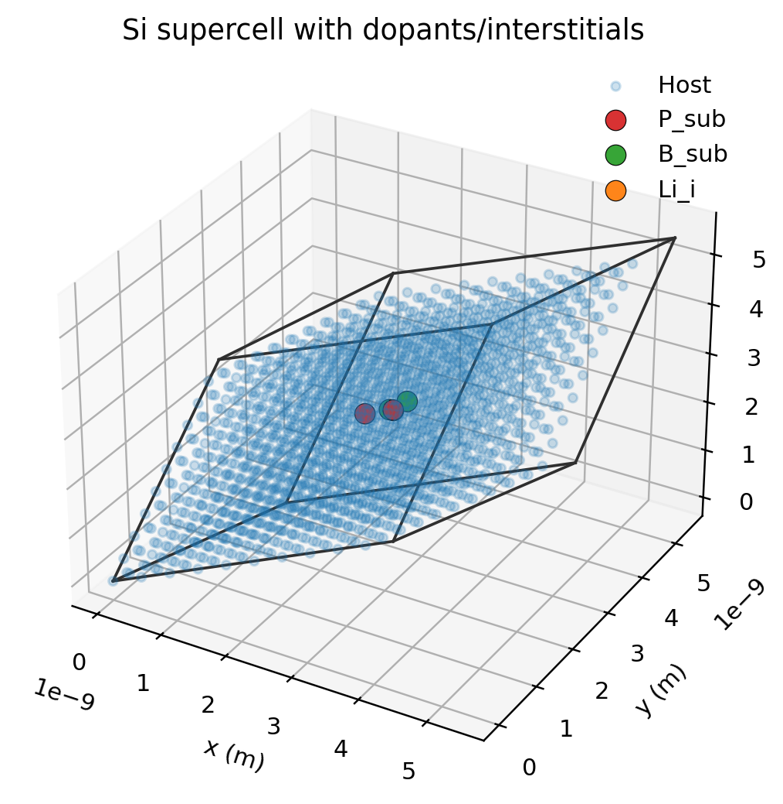
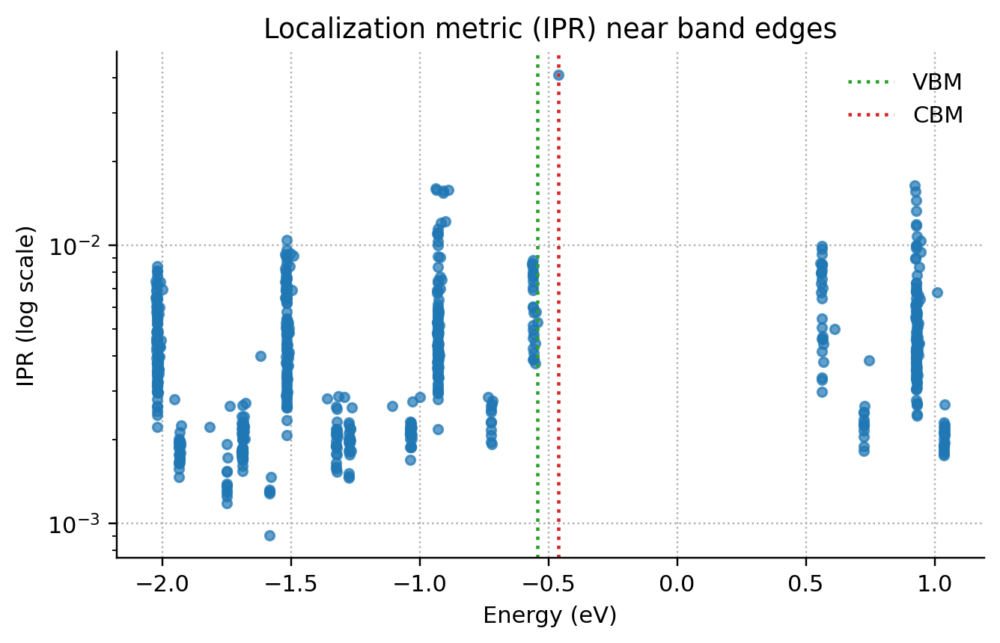

# Semiconductor Physics: From Band Structure to Devices

A small quantum-materials toolkit (`quantsim`) and two research notebooks that go from **electronic structure** of silicon to **device behaviour**:

1. `silicon_epm_diode.ipynb`: empirical-pseudopotential band structure → doping and band-gap narrowing → carrier statistics → p-n junction → Shockley–Queisser solar-cell limit.
2. `supercell_tightbinding_si.ipynb`: a 2,000-atom real-space tight-binding supercell of silicon with substitutional donors/acceptors and an interstitial. Diagonalizing the Hamiltonian gives the spectrum, DOS, localization (IPR) and impurity-state wavefunctions.



## Empirical pseudopotential method (EPM)

The crystal potential is expanded in plane waves using the Cohen–Bergstresser (1966) form factors for Si ($V_3, V_8, V_{11}$), with the origin at the bond centre so the structure factor is $\cos(\mathbf{G}\cdot\boldsymbol{\tau})$, $\boldsymbol{\tau} = \tfrac{a}{8}(1,1,1)$. At each k-point the basis is $|\mathbf{k}+\mathbf{G}| \le G_\text{cut}$ (≈ 90 plane waves), and the Hamiltonian is built vectorized and diagonalized along Γ–X–W–K–Γ–L–U–W–L–K.

The model reproduces the textbook silicon band structure without fitting:

| Feature | This model | Literature (CB 1966 / expt.) |
|:--|--:|--:|
| Γ₂₅′ → Γ₁₅ direct gap | 3.56 eV | 3.4 eV |
| Valence band width | 12.7 eV | 12.5 eV |
| L₃′ (below VBM) | −1.2 eV | −1.2 eV |
| Conduction-band minimum | 0.85 along Γ–X | 0.85 along Γ–X |
| X₁ degeneracy | 2-fold | 2-fold |

A local EPM underestimates the indirect gap (≈0.8 eV here), so the notebook applies a scissor correction to 1.12 eV plus empirical band-gap narrowing for the doping level.

### In 3D

`render_3d.py` evaluates the same EPM Hamiltonian at arbitrary k-points (`quantsim.epm_energies`). It plots the bands over the whole $k_z=0$ plane and finds every state within 150 meV of the conduction-band minimum in the first Brillouin zone. These are silicon's six Δ valleys, elongated along ⟨100⟩ because the longitudinal mass is about 5× the transverse mass.

| Bands over $k_z = 0$ | Conduction valleys |
|:--:|:--:|
|  |  |

## Carriers, junction and solar limit

- Varshni $E_g(T)$, $N_{c,v}\propto T^{3/2}$, intrinsic density $n_i(T)$, and Fermi level from band-edge Boltzmann statistics.
- Abrupt p-n junction: built-in potential, depletion widths, and the temperature-dependent Shockley I–V with mobility $\mu \propto T^{-3/2}$.
- Detailed-balance (Shockley–Queisser) limit with a 5778 K blackbody sun. The incident power comes out at 1317 W/m² (solar constant ≈ 1361), and silicon at 1.06 eV reaches **30.1%** efficiency with $V_{oc}$ = 0.83 V.

| | |
|:--:|:--:|
|  |  |

## Tight-binding supercell

A 10×10×10 diamond supercell (2,001 sites with periodic boundaries) uses distance-decayed hopping and an A/B sublattice splitting, calibrated by bisection to a 1.12 eV gap. Two donors, two acceptors and a Li interstitial add onsite shifts plus a screened Gaussian impurity potential.

The doped spectrum has one state about **10× more localized** (inverse participation ratio) than any band state, sitting **0.08 eV above the valence band**: an acceptor-like impurity level in the gap. The notebook's half-filling "VBM/CBM" markers bracket exactly this level.

| | |
|:--:|:--:|
|  |  |

`si_orbital_states.html` in the same folder is an interactive viewer for the band-edge wavefunctions.

## Run it

```bash
pip install -r ../requirements.txt
jupyter notebook silicon_epm_diode.ipynb          # ~20 s
jupyter notebook supercell_tightbinding_si.ipynb  # ~1 min
python -m pytest -q tests
python render_3d.py                               # 3D band surfaces and valleys, ~40 s
```

The tests check the FCC k-path coordinates, the EPM band features above, SQ power and efficiency, Fermi-level bounds, and diamond coordination.

## Layout

- `quantsim/lattice.py`, `bz.py`: Bravais lattices, reciprocal lattice, high-symmetry k-paths (fractional coordinates)
- `quantsim/epm.py`: plane-wave EPM solver (`epm_energies` for arbitrary k), scissor correction, form-factor calibration
- `render_3d.py`: 3D band surfaces and conduction valleys
- `quantsim/tightbinding.py`: supercell builder, periodic neighbour search, Hamiltonian, DOS
- `quantsim/stats.py`, `fermi.py`, `doping.py`, `diode.py`, `solar.py`: carrier statistics and device models
- `quantsim/plotting.py`: band-structure and crystal plots

## Limitations

The EPM is local and has no spin–orbit coupling. The tight-binding model is a single-orbital toy (a real Si gap needs an sp³s* basis), so its gap is calibrated rather than predicted. Carrier statistics are non-degenerate, so they are approximate above ~10¹⁹ cm⁻³.
